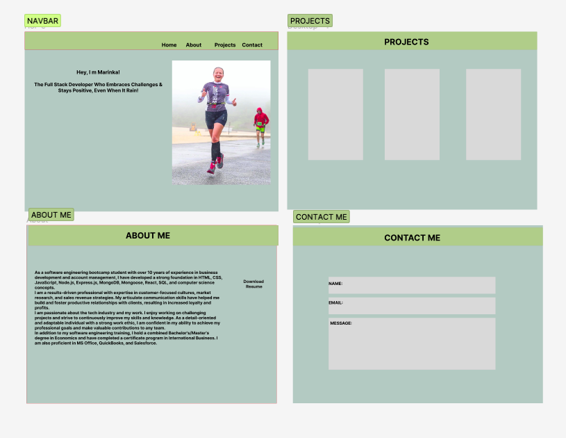

# Marinka's Portfolio React App

This is a simple portfolio website built with React. The website showcases Marinka's skills and projects. The website is deployed using Netlify and is accessible at https://marinkas-portfolio.netlify.app/.

## Features
- Home page with a welcome message and links to Marinka's LinkedIn and GitHub profiles.
- About page with a brief introduction of Marinka's background, skills, and interests, as well as a downloadable resume.
- Projects page with a list of Marinka's recent projects, including descriptions and links to view the projects online.
- Contact page with a simple form for visitors to contact Marinka.
- Tech News section displaying the latest technology news, using the News API.
- Responsive design optimized for desktop and mobile devices
Navbar with links to all pages that smoothly scrolls to the relevant sections
- Downloadable resume in the About Me page
- State management using React hooks, including useState for form input fields and checkboxes, and useEffect for fetching data from the News API and Marinka's API.

## Wireframe

The wireframe for this project was created using Figma. The wireframe was designed to provide a visual representation of the website's layout and features.

## Technologies

This project was built using the following technologies:

## Packages Used
- React-Bootstrap: I used this package extensively throughout my project to create and style components like the navigation bar, jumbotron, about section, and project cards. Additionally, the Carousel component was used in the TechNews section to display the latest technology news. For example, the Navbar, Nav, and NavDropdown components were used to create the navigation bar, and the Container, Row, and Col components were used to create a responsive layout for the website. The Card and Button components were used to create the project cards and buttons, and the Jumbotron component was used to create the hero (home) section.

- React-Scroll: I used this package to add smooth scrolling functionality to my navigation links. I used the Link component from react-scroll to wrap the Nav.Link components in my navigation bar. This allows users to smoothly scroll to the corresponding section on the website when clicking on a navigation link.

- React-FontAwesome: I used this package to display social media icons in my footer section. The FontAwesomeIcon component from react-fontawesome was used to import and render the appropriate icons for each social media platform (e.g. LinkedIn, GitHub, and email).

- EmailJS: I used this package to set up and send emails from the contact form on the website. Specifically, I used the EmailJS API to configure email templates and integrate the form submission with an email service. The email service sends an email to my designated email address whenever a user submits the contact form on the website.

- Axios: I used this package to fetch data from the News API and display it in the News component. Specifically, the axios.get() method was used to make a GET request to the News API endpoint, and the response data was used to dynamically render news articles in a card format. I also used axios to fetch data from my own API in the Projects component, to dynamically render the projects from the API in the project cards.

## API Used
- News API: used to display the latest technology news

## References 
- Awesome Classmates!
- https://css-tricks.com/css3-gradients/
- https://stackoverflow.com/
- https://www.youtube.com/
- https://fontawesome.com/